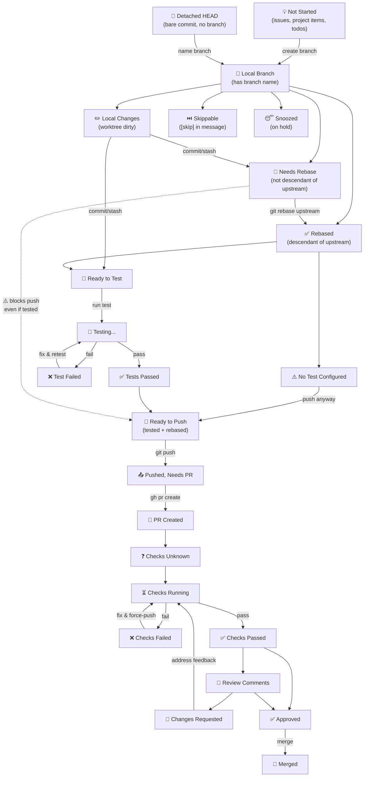
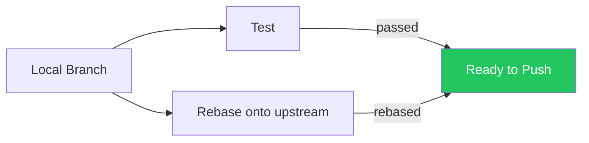
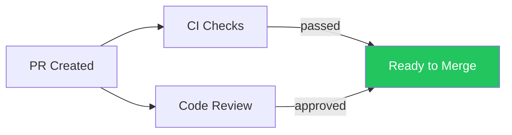

# Work-in-Progress Stages

This document describes the lifecycle stages that work items move through in WIP, from initial idea to merged PR.

## Overview

WIP tracks work across multiple git repositories. Each piece of work starts as an idea (issue, project item, todo) and progresses through local development, testing, pushing, PR creation, CI checks, and code review. The system discovers work automatically from git state and GitHub APIs.

## Stage Diagram

## Diamond: Rebase + Test

The most important structural insight is that **rebase** and **test** are independent, parallel requirements that must both be satisfied before pushing:

A branch can be:
- **Tested but not rebased** — tests passed on the old base, needs `git rebase upstream/main`
- **Rebased but not tested** — freshly rebased, needs test run
- **Neither** — just created, needs both
- **Both** — ready to push

This means after a rebase, tests should re-run (since the code has changed). And after fixing a test failure, you don't need to re-rebase (the base hasn't changed). The classify logic should track these independently.

## Diamond: CI Checks + Review

A second diamond exists after PR creation:

Currently the UI treats these as a linear sequence (checks → review → approved), but in practice:
- A reviewer can approve while checks are still running
- Checks can pass before review is requested
- Both must be green to merge

## Stage Details

### Entry Points (Not Started)

| Source | Description |
|--------|-------------|
| GitHub Issues | Assigned issues from repos you work on |
| GitHub Project Items | Cards from GitHub Project boards |
| Todo files | Tasks from `todo.md` files in repos |

These are discovered automatically and shown in the "Not Started" column. They transition to active work when you create a commit or branch.

### Local Development Stages

| Stage | Category | Trigger |
|-------|----------|---------|
| **Detached HEAD** | `detached_head` | Bare commit with no branch name |
| **Skippable** | `skippable` | Commit message contains `[skip]`, `[pass]`, `[stop]`, or `[fail]` |
| **Snoozed** | `snoozed` | User manually snoozed the item |
| **Local Changes** | `local_changes` | Worktree is dirty (uncommitted changes) |
| **No Test** | `no_test` | Project has no `git test` configured |
| **Ready to Test** | `ready_to_test` | Branch exists, worktree clean, tests not yet run |
| **Test Failed** | `test_failed` | `git test run` exited non-zero |
| **Ready to Push** | `ready_to_push` | Tests passed, ready for `git push` |

### Remote Stages

| Stage | Category | Trigger |
|-------|----------|---------|
| **Pushed, Needs PR** | `pushed_no_pr` | Branch pushed to remote, no open PR |
| **Checks Unknown** | `checks_unknown` | PR exists, no CI status yet |
| **Checks Running** | `checks_running` | CI checks in progress |
| **Checks Failed** | `checks_failed` | CI checks failed |
| **Checks Passed** | `checks_passed` | CI checks passed, awaiting review |
| **Review Comments** | `review_comments` | Reviewer left comments |
| **Changes Requested** | `changes_requested` | Reviewer requested changes |
| **Approved** | `approved` | PR approved and ready to merge |

## Current Limitations

### Missing: Needs Rebase Stage

**Currently, branches that are not descendants of `upstream/main` are invisible.** The `git children` command only returns commits that descend from the upstream ref. Branches that diverged before the latest upstream (i.e., need rebasing) simply don't appear in the UI.

This should be fixed so that:
1. All local branches are discovered (not just children of upstream)
2. Branches not containing upstream are classified as `needs_rebase`
3. The rebase+test diamond is properly modeled in the classify logic

### Missing: Independent Rebase + Test Tracking

The current classify logic treats rebase and test as sequential. A branch that's been tested but needs rebase is invisible (not a child of upstream). A branch that's been rebased but not tested shows as `ready_to_test`. The diamond relationship isn't tracked.

Ideally, the UI would show:
- "Needs rebase" — not a descendant of upstream
- "Needs rebase + test" — neither done
- "Needs test" — rebased but untested
- "Ready to push" — both done
