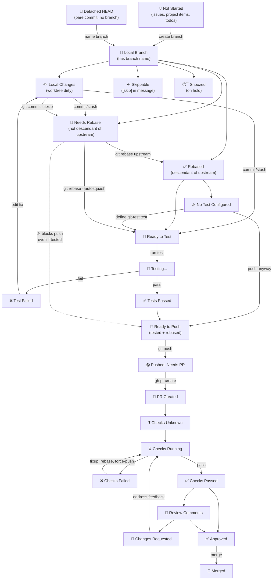
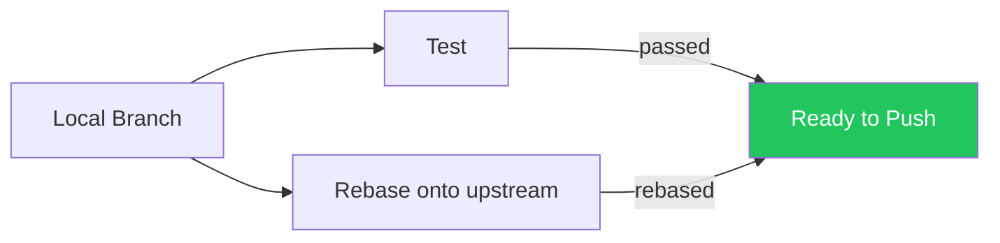
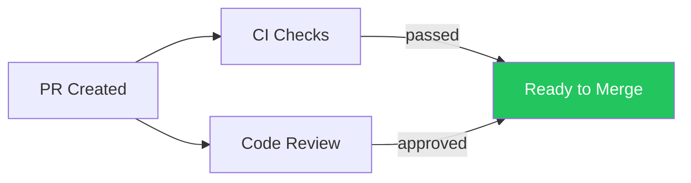

# Work-in-Progress Stages

This document describes the lifecycle stages that work items move through in WIP, from initial idea to merged PR.

## Overview

WIP tracks work across multiple git repositories. Each piece of work starts as an idea (issue, project item, todo) and progresses through local development, testing, pushing, PR creation, CI checks, and code review. The system discovers work automatically from git state and GitHub APIs.

## Simple Diagram (NFA)

This diagram shows the intuitive flow. It hides combinatorial state — many of these dimensions are independent and can combine in ways the diagram doesn't show.

## State Dimensions (DFA model)

The simple diagram above is an NFA — it hides the fact that many dimensions are independent. The real state of a work item is the combination of all these dimensions. This section enumerates them, like converting an NFA to a DFA.

GitHub's GraphQL API has a `MergeStateStatus` enum (BEHIND, BLOCKED, CLEAN, DIRTY, DRAFT, HAS_HOOKS, UNKNOWN, UNSTABLE) that covers ~8 states for the PR-merge phase only. Our model extends this to cover the full local-to-merged lifecycle. The **Conflicts** and **Draft** dimensions below are inspired by GitHub's DIRTY and DRAFT states.

### Item dimensions

These are properties of an individual work item (commit, branch, or PR).

| Dimension | Values | Notes |
|-----------|--------|-------|
| **Work type** | `idea` / `bare_commit` / `branch` / `pr` | What kind of thing is it |
| **Commits ahead** | 0 / 1 / n | Single-commit branches are most ready |
| **Worktree** | `clean` / `dirty` | Dirty blocks testing |
| **Rebased** | `yes` / `no` | Is upstream/main an ancestor of this branch |
| **Conflicts** | `none` / `has_conflicts` | Can rebase cleanly, or has merge conflicts (from GitHub: DIRTY) |
| **Test result** | `untested` / `passed` / `failed` | Result of `git test run` |
| **Remote sync** | `local_only` / `in_sync` / `local_ahead` / `remote_ahead` | Relationship between local and remote branch |
| **Draft** | `n/a` / `yes` / `no` | PR opened as draft for early CI feedback (from GitHub: DRAFT) |
| **CI checks** | `n/a` / `unknown` / `running` / `passed` / `failed` | GitHub Actions status |
| **Review** | `n/a` / `comments` / `changes_requested` / `approved` | PR review status |
| **Override** | `normal` / `snoozed` / `skippable` | User explicitly deprioritized |

### Project dimensions

These are properties of the project, not any individual item. They block or alter the progression of all items in that project.

| Dimension | Values | Notes |
|-----------|--------|-------|
| **Test defined** | `yes` / `no` | Does the project have `git test` configured |
| **Upstream fetched** | `fresh` / `stale` | Has upstream been fetched recently |

### Constraints (unreachable combinations)

Not all dimension combinations are possible. These constraints prune the DFA:

| Constraint | Reason |
|------------|--------|
| `bare_commit` → remote_sync = `local_only` | Can't push without a branch |
| `bare_commit` → rebased = `yes` | Bare commits are children of upstream by definition |
| `idea` → all git dimensions are `n/a` | Ideas have no git state |
| `pr` → remote_sync ≠ `local_only` | PR requires a pushed branch |
| CI checks ≠ `n/a` → work_type = `pr` | Only PRs have CI checks |
| Review ≠ `n/a` → work_type = `pr` | Only PRs have reviews |
| test_result ≠ `untested` → test_defined = `yes` | Can't have test results without a test |
| worktree = `dirty` → test_result = `untested` | Can't test with uncommitted changes |
| conflicts = `has_conflicts` → rebased = `no` | Conflicts only matter when not rebased |
| rebased = `yes` → conflicts = `none` | Successfully rebased means no conflicts |
| draft = `yes` → review = `n/a` | Draft PRs don't have review status |
| draft ≠ `n/a` → work_type = `pr` | Only PRs can be drafts |
| remote_sync = `local_only` → CI checks = `n/a` | Nothing pushed, no CI |
| snoozed/skippable → all other dimensions are irrelevant | User override, shown last regardless |

### Full State Table (DFA)

Every reachable state combination, numbered by priority (highest = most done). The queue shows items in descending order.

#### Override states (shown last regardless of other dimensions)

| # | State | Override |
|---|-------|----------|
| 1 | Snoozed | `snoozed` |
| 2 | Skippable | `skippable` |

#### Idea states (no git state)

| # | State | Work type |
|---|-------|-----------|
| 3 | Not started (todo) | `idea` (todo file) |
| 4 | Not started (issue) | `idea` (GitHub issue) |
| 5 | Not started (project item) | `idea` (GitHub project board) |

#### Bare commit states (detached HEAD, no branch)

| # | State | Worktree | Test def | Test result | Notes |
|---|-------|----------|----------|-------------|-------|
| 6 | Bare commit, dirty | dirty | — | untested | Needs commit, then branch |
| 7 | Bare commit, no test | clean | no | untested | Needs branch + test config |
| 8 | Bare commit, untested | clean | yes | untested | Needs branch, then test |
| 9 | Bare commit, test failed | clean | yes | failed | Fix, then create branch |
| 10 | Bare commit, test passed | clean | yes | passed | Just needs a branch name |

#### Branch states (local development)

| # | State | Commits | Worktree | Rebased | Conflicts | Test def | Test result | Remote sync | Notes |
|---|-------|---------|----------|---------|-----------|----------|-------------|-------------|-------|
| 11 | Branch, dirty | any | dirty | — | — | — | untested | — | Needs commit |
| 12 | Branch, no test, conflicts | any | clean | no | yes | no | untested | local_only | Resolve conflicts, then rebase + test config |
| 13 | Branch, no test, not rebased | any | clean | no | no | no | untested | local_only | Rebase, then needs test config |
| 14 | Branch, no test, rebased | any | clean | yes | — | no | untested | local_only | Stuck: needs test config |
| 15 | Branch, conflicts, untested | any | clean | no | yes | yes | untested | local_only | Resolve conflicts, rebase, test |
| 16 | Branch, not rebased, untested | any | clean | no | no | yes | untested | local_only | Rebase, then test |
| 17 | Branch, rebased, untested | any | clean | yes | — | yes | untested | local_only | Ready to test |
| 18 | Branch, conflicts, test failed | any | clean | no | yes | yes | failed | local_only | Fix, resolve conflicts, rebase, retest |
| 19 | Branch, not rebased, test failed | any | clean | no | no | yes | failed | local_only | Fix, rebase, retest |
| 20 | Branch, rebased, test failed | any | clean | yes | — | yes | failed | local_only | Fix and retest |
| 21 | Branch, not rebased, test passed | any | clean | no | no | yes | passed | local_only | Rebase (invalidates test?) |
| 22 | Branch, rebased, test passed, multi-commit | n>1 | clean | yes | — | yes | passed | local_only | Split or squash, then push |
| 23 | Branch, rebased, test passed, single-commit | 1 | clean | yes | — | yes | passed | local_only | Ready to push |

#### Pushed states (remote branch exists, no PR yet)

| # | State | Remote sync | Notes |
|---|-------|-------------|-------|
| 24 | Pushed, in sync, needs PR | in_sync | Create PR |
| 25 | Pushed, local ahead, needs PR | local_ahead | Push first, then create PR |

#### Draft PR states (early CI feedback, not requesting review)

| # | State | Remote sync | Draft | CI checks | Notes |
|---|-------|-------------|-------|-----------|-------|
| 26 | Draft PR, checks unknown | in_sync | yes | unknown | Waiting for CI |
| 27 | Draft PR, checks running | in_sync | yes | running | CI in progress |
| 28 | Draft PR, checks failed | in_sync | yes | failed | Fix, force-push |
| 29 | Draft PR, checks passed | in_sync | yes | passed | Mark ready for review |

#### PR states (CI checks + review)

| # | State | Remote sync | Draft | CI checks | Review | Notes |
|---|-------|-------------|-------|-----------|--------|-------|
| 30 | PR, checks unknown | in_sync | no | unknown | n/a | Waiting for CI |
| 31 | PR, checks running | in_sync | no | running | n/a | CI in progress |
| 32 | PR, checks failed | in_sync | no | failed | n/a | Fix, force-push |
| 33 | PR, checks failed, local ahead | local_ahead | no | failed | n/a | Need to force-push fix |
| 34 | PR, checks passed, no review | in_sync | no | passed | n/a | Request review |
| 35 | PR, checks passed, review comments | in_sync | no | passed | comments | Address comments |
| 36 | PR, checks passed, changes requested | in_sync | no | passed | changes_requested | Address feedback |
| 37 | PR, checks running, approved | in_sync | no | running | approved | Wait for CI |
| 38 | PR, checks passed, approved | in_sync | no | passed | approved | Ready to merge |

## Diamonds

### Diamond: Rebase + Test

The most important structural insight is that **rebase** and **test** are independent, parallel requirements that must both be satisfied before pushing:

A branch can be:
- **Tested but not rebased** — tests passed on the old base, needs `git rebase upstream/main`
- **Rebased but not tested** — freshly rebased, needs test run
- **Neither** — just created, needs both
- **Both** — ready to push

This means after a rebase, tests should re-run (since the code has changed). And after fixing a test failure, you don't need to re-rebase (the base hasn't changed). The classify logic should track these independently.

### Diamond: CI Checks + Review

A second diamond exists after PR creation:

Currently the UI treats these as a linear sequence (checks → review → approved), but in practice:
- A reviewer can approve while checks are still running
- Checks can pass before review is requested
- Both must be green to merge

## Card Ordering Within Categories

Within each kanban column or queue category, cards are ordered by readiness — how close they are to being pushed to GitHub:

1. **Pull requests** — already on GitHub, furthest along
2. **Single-commit branches** (`commitsAhead = 1`) — just need `git push`
3. **Bare commits** — need a branch name created, then push
4. **Multi-commit branches** (`commitsAhead > 1`) — need splitting or squashing before landing
5. **Issues, project items, todos** — not yet started

This reflects a one-commit-at-a-time workflow where each branch should ideally contain a single atomic commit.

## Classify Logic → DFA Mapping

The current `classify.ts` maps items to the old `Category` enum. This section traces every code path and maps it to a DFA state, revealing which states are distinguished vs collapsed.

### classifyCommit (bare commits — CommitItem)

| Code path | Old category | DFA # | DFA state | Notes |
|-----------|-------------|-------|-----------|-------|
| `commit.skippable` | `skippable` | 2 | Skippable | |
| `project.detachedHead` | `detached_head` | 6–10 | Bare commit (any) | Collapses all bare commit substates |
| `project.dirty` | `local_changes` | 6 | Bare commit, dirty | |
| `!project.hasTestConfigured` | `no_test` | 7 | Bare commit, no test | |
| default | `ready_to_test` | 8 | Bare commit, untested | |

**Missing**: CommitItem has no `testStatus` field, so #9 (bare commit, test failed) and #10 (bare commit, test passed) are unreachable. Bare commits can't be tested in the current model.

### classifyBranch (branches — BranchItem)

| Code path | Old category | DFA # | DFA state | Notes |
|-----------|-------------|-------|-----------|-------|
| `branch.skippable` | `skippable` | 2 | Skippable | |
| `testStatus === 'failed'` | `test_failed` | 18–20 | Branch, test failed | Not checking rebased or conflicts |
| `pushedToRemote && branch !== upstream` | `pushed_no_pr` | 24 or 25 | Pushed, needs PR | Not checking sync state |
| `testStatus === 'passed'` | `ready_to_push` | 21–23 | Branch, test passed | Not checking rebased or commit count |
| `project.dirty` | `local_changes` | 11 | Branch, dirty | |
| `!project.hasTestConfigured` | `no_test` | 12–14 | Branch, no test | Not checking rebased or conflicts |
| default | `ready_to_test` | 15–17 | Branch, untested | Not checking rebased or conflicts |

**Missing**: `needsRebase` field exists on BranchItem but classify ignores it. `commitsAhead` exists but classify ignores it. `rebaseable` (conflict detection) exists but classify ignores it. Conflict states #12, #15, #18 collapsed with non-conflict counterparts. Rebase states #13, #16, #19, #21, #22 collapsed with rebased counterparts.

### classifyPullRequest (PRs — PullRequestItem)

| Code path | Old category | DFA # | DFA state | Notes |
|-----------|-------------|-------|-----------|-------|
| `pr.skippable` | `skippable` | 2 | Skippable | |
| `checkStatus === 'failed'` | `checks_failed` | 32 | PR, checks failed | Checked before review — blocks approved |
| `checkStatus === 'running'/'pending'` | `checks_running` | 31, 37 | PR, checks running | Checked before review — blocks approved |
| `reviewStatus === 'approved' && checkStatus === 'passed'` | `approved` | 38 | PR, approved | Both checks and review must pass |
| `reviewStatus === 'changes_requested'` | `changes_requested` | 36 | PR, changes requested | After CI blocking checks |
| `reviewStatus === 'commented'` | `review_comments` | 35 | PR, review comments | After CI blocking checks |
| `checkStatus === 'passed'` | `checks_passed` | 34 | PR, checks passed | |
| `checkStatus === 'unknown'/'none'` | `checks_unknown` | 30 | PR, checks unknown | |
| default | `checks_running` | 31 | PR, checks running | Fallback |

**Missing**: Draft PR states #26–29 not distinguished (no draft detection). #33 (checks failed + local ahead) collapsed with #32.

### Idea items (not classified — added directly in useWorkItems)

| Source | DFA # | DFA state |
|--------|-------|-----------|
| TodoItem | 3 | Not started (todo) |
| IssueItem | 4 | Not started (issue) |
| ProjectBoardItem | 5 | Not started (project item) |
| SnoozedChild | 1 | Snoozed |

### Summary: DFA states reachable in current code

| DFA # | State | Reachable? | Via |
|-------|-------|------------|-----|
| 1 | Snoozed | yes | snoozed query |
| 2 | Skippable | yes | all three classifiers |
| 3 | Not started (todo) | yes | useWorkItems |
| 4 | Not started (issue) | yes | useWorkItems |
| 5 | Not started (project item) | yes | useWorkItems |
| 6 | Bare commit, dirty | yes | classifyCommit |
| 7 | Bare commit, no test | yes | classifyCommit |
| 8 | Bare commit, untested | yes | classifyCommit |
| 9 | Bare commit, test failed | **bug** | CommitItem drops testStatus from ChildCommit |
| 10 | Bare commit, test passed | **bug** | CommitItem drops testStatus from ChildCommit |
| 11 | Branch, dirty | yes | classifyBranch |
| 12 | Branch, no test, conflicts | **collapsed** | shown as #14 (no_test) |
| 13 | Branch, no test, not rebased | **collapsed** | shown as #14 (no_test) |
| 14 | Branch, no test, rebased | yes | classifyBranch |
| 15 | Branch, conflicts, untested | **collapsed** | shown as #17 (ready_to_test) |
| 16 | Branch, not rebased, untested | **collapsed** | shown as #17 (ready_to_test) |
| 17 | Branch, rebased, untested | yes | classifyBranch |
| 18 | Branch, conflicts, test failed | **collapsed** | shown as #20 (test_failed) |
| 19 | Branch, not rebased, test failed | **collapsed** | shown as #20 (test_failed) |
| 20 | Branch, rebased, test failed | yes | classifyBranch |
| 21 | Branch, not rebased, test passed | **collapsed** | shown as #23 (ready_to_push) |
| 22 | Branch, rebased, test passed, multi | **collapsed** | shown as #23 (ready_to_push) |
| 23 | Branch, rebased, test passed, single | yes | classifyBranch |
| 24 | Pushed, in sync, needs PR | yes | classifyBranch |
| 25 | Pushed, local ahead, needs PR | **collapsed** | shown as #24 |
| 26 | Draft PR, checks unknown | **collapsed** | shown as #30 (no draft detection) |
| 27 | Draft PR, checks running | **collapsed** | shown as #31 (no draft detection) |
| 28 | Draft PR, checks failed | **collapsed** | shown as #32 (no draft detection) |
| 29 | Draft PR, checks passed | **collapsed** | shown as #34 (no draft detection) |
| 30 | PR, checks unknown | yes | classifyPullRequest |
| 31 | PR, checks running | yes | classifyPullRequest |
| 32 | PR, checks failed | yes | classifyPullRequest |
| 33 | PR, checks failed, local ahead | **collapsed** | shown as #32 |
| 34 | PR, checks passed, no review | yes | classifyPullRequest |
| 35 | PR, review comments | yes | classifyPullRequest |
| 36 | PR, changes requested | yes | classifyPullRequest |
| 37 | PR, checks running, approved | yes | classifyPullRequest (shown as checks_running) |
| 38 | PR, approved | yes | classifyPullRequest |

**21 of 38 states are reachable.** 17 are collapsed or unreachable:
- 2 unreachable (bare commit test results — no field exists)
- 4 collapsed (draft PRs — no draft detection in current code)
- 11 collapsed (rebase/conflict status, commit count, and remote sync not checked)

## Current Limitations

### Missing: Needs Rebase Stage

**Currently, branches that are not descendants of `upstream/main` are invisible.** The `git children` command only returns commits that descend from the upstream ref. Branches that diverged before the latest upstream (i.e., need rebasing) simply don't appear in the UI.

This should be fixed so that:
1. All local branches are discovered (not just children of upstream)
2. Branches not containing upstream are classified as `needs_rebase`
3. The rebase+test diamond is properly modeled in the classify logic

### Missing: Independent Rebase + Test Tracking

The current classify logic treats rebase and test as sequential. A branch that's been tested but needs rebase is invisible (not a child of upstream). A branch that's been rebased but not tested shows as `ready_to_test`. The diamond relationship isn't tracked.

Ideally, the UI would show:
- "Needs rebase" — not a descendant of upstream
- "Needs rebase + test" — neither done
- "Needs test" — rebased but untested
- "Ready to push" — both done

### Missing: Conflict Detection

The `rebaseable` field exists on BranchItem (computed via `git merge-tree`) but classify ignores it. Branches that need rebase should be split into "clean rebase" (automatic, just run `git rebase`) vs "conflicted rebase" (requires manual conflict resolution). Conflicted branches are harder to fix and should rank lower. Inspired by GitHub's `MergeStateStatus.DIRTY`.

### Missing: Draft PR Detection

Draft PRs are a real intermediate state between "pushed, needs PR" and "PR ready for review." They're used to get early CI feedback without requesting review. The current code doesn't distinguish draft from non-draft PRs. Inspired by GitHub's `MergeStateStatus.DRAFT`.

### Missing: Remote Sync Tracking

The current model treats "pushed" as a binary state. It doesn't track whether the local branch is ahead of, behind, or in sync with the remote branch. This matters for:
- Knowing when a force-push is needed after fixup+rebase
- Detecting when remote has diverged (e.g., after pushing from another machine)
- Distinguishing "needs push" from "needs PR creation"

### Missing: Project-Level Properties

`no_test` and `upstream_stale` are properties of the **project**, not individual items. They should be surfaced as project-level warnings when that project has active work items, rather than mixed into the item state machine.
